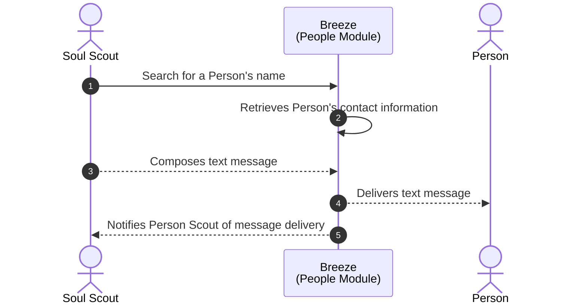
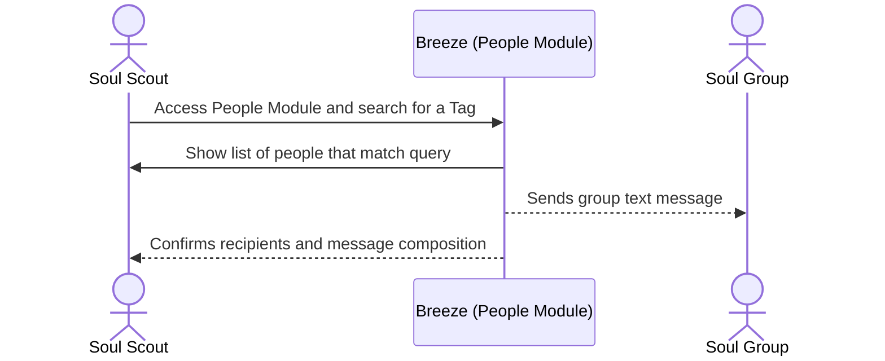
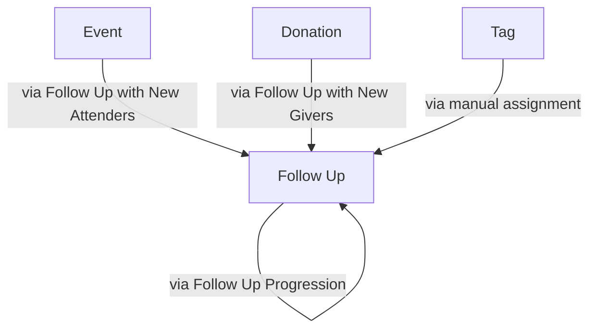
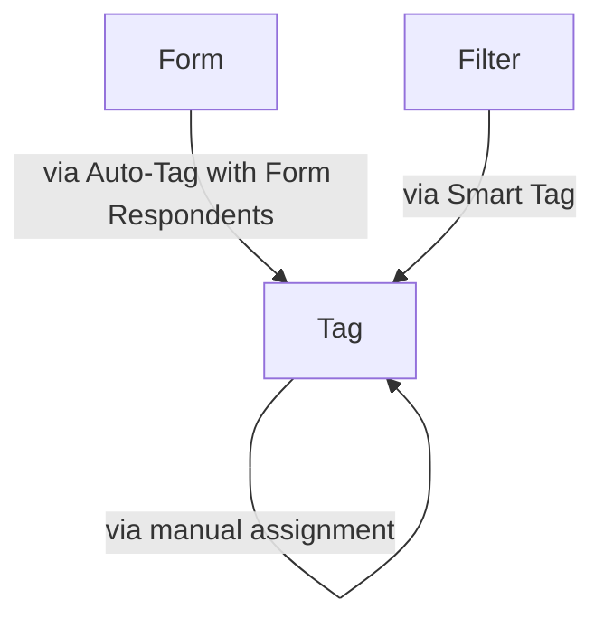

SVA Breeze Manual
===

# Introduction

Welcome to SVA Breeze! This manual will guide you through the various features and functionalities of the platform to help streamline your temple management tasks at Sacred Vedic Arts, located in Miami, Florida.

- **Location**: [137 NE 47th St, Miami, FL 33137](https://maps.app.goo.gl/Yyr7cGBa51q1ivxj9)
- **Website**: [Sacred Vedic Arts](https://sacredvedicarts.org/)
- **Contact Number**: +1 (347) 727-8692

If you encounter any issues during setup or usage, please reach out to Haridas Brahmachari at [email@example.com](mailto:email@example.com) for assistance.

This manual aims to provide comprehensive instructions and insights into maximizing the capabilities of SVA Breeze for your temple management needs at Sacred Vedic Arts. If you have any questions or require further assistance, don't hesitate to contact Haridas Brahmachari.

#### Why are we using Breeze? What problems are we trying to solve?

- **Problem**: We get a lot of contact information from our manual sign-ups on pen and paper but we never get to reach out to them and do follow-ups.
- **Solution**: Consolidate the contact inforrmation into a database, digitalize our data, automate reaching out to our contacts

# Breeze Main Modules

SVA Breeze offers several main modules to facilitate efficient temple management:

1. **Dashboard**: Generate insightful reports on attendance, giving trends, and other temple-related metrics.

1. **People**: Manage congregants' information, communication preferences, and involvement in various temple activities.

1. **Giving**: Track and manage contributions, generate giving reports, and facilitate online giving options.

1. **Tags**: Categorize individuals based on characteristics, interests, or involvement for targeted communication and organization.

1. **Events**: Plan and organize temple events, track attendance, and manage event-related tasks.

1. **Follow Ups**: Manage and track tasks assigned to staff or volunteers in relation to specific individuals in the temple database.

1. **Forms**: Create custom forms for gathering information, registrations, and feedback from congregants.

## Signing In

- **Sign In Page:** [https://sacredvedicarts.breezechms.com/login](https://sacredvedicarts.breezechms.com/login)

## [SMS] Sending a message to an individual

TO DO: Add note on limitations

In this sequence:

1. Soul Scout (or admin) searches for Soul's name within the "People" module of SVA Breeze.
2. Breeze retrieves Soul's contact information from the database.
3. Breeze composes the text message within the platform.
4. Breeze delivers the text message to Soul.
5. Breeze notifies Soul Scout of the message delivery status.

## [SMS] Text A Group of People Using Breeze

Reference: https://support.breezechms.com/hc/en-us/articles/360001145594-Texting-People

## [Email] Send an email to an individual

https://support.breezechms.com/hc/en-us/articles/360001145134-Emailing-a-Person-or-Group

## [Email] Send an email to a group

Add a template too

https://support.breezechms.com/hc/en-us/articles/360001145134-Emailing-a-Person-or-Group

## Create an email template

## Update an email template

## Some notes

How can a person be assigned to a Follow Up?

How can a person be assigned to a Tag?

